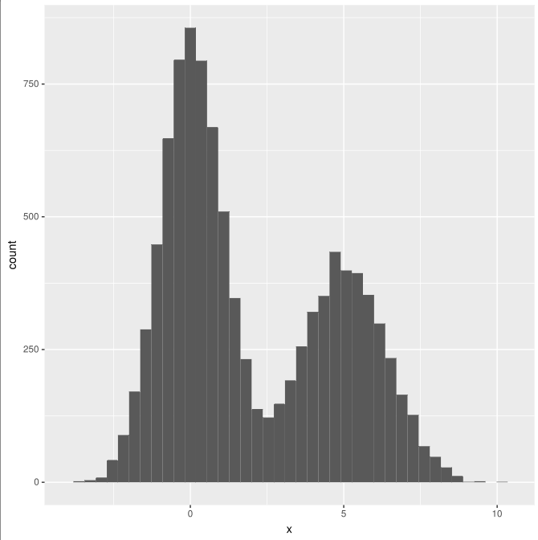

# cplint_r

An SWI Prolog library to plot R's ggplot2 graphs for Cplint on SWISH.

## Description

This library is to be used with [Cplint on SWISH](https://github.com/friguzzi/swish).

At the moment, it is included as part of the installation process 
in the [swish-cplint](https://aur.archlinux.org/packages/swish-cplint) package
for the Arch GNU/Linux distribution (and derivatives).

The structure of this repository follows (more or less) some
interesting
[guidelines](https://rlaanemets.com/post/show/prolog-pack-development-experience) 
written by Raivo Laanemets.

## Example

Taken from
[here](https://github.com/friguzzi/swish/blob/master/examples/inference/gaussian_mixture_R.pl)

```
/*
Mixture of two Gaussians. A biased coin is thrown, if it lands heads X in 
mix(X)
is sampled from a Gaussian with mean 0 and variance 1. if it lands tails X is
sampled from a Gaussian with mean 5 and variance 2.
The example illustrates the use of continuous random variables and
the use of sampling, including
rejection sampling and Metropolis/Hastings. Moreover the example
illustrates the use of the predicate histogram/2 for graphing the
probability density function of continuous random variables.
*/
:- use_module(library(mcintyre)).
:- use_module(library(cplint_r)).

:- mc.
:- begin_lpad.

heads:0.6;tails:0.4. 
% a coin is thrown. The coin is biased: with probability 0.6 it lands heads,
% with probabiity 0.4 it lands tails

g(X): gaussian(X,0, 1).
% X in g(X)  follows a Gaussian distribution with mean 0 and variance 1
h(X): gaussian(X,5, 2).
% X in h(X)  follows a Gaussian distribution with mean 5 and variance 2

mix(X) :- heads, g(X).
% if the coin lands heads, X in mix(X) is given by g(X)
mix(X) :- tails, h(X).
% if the coin lands tails, X in mix(X) is given by h(X)

:- end_lpad.

hist_uncond(Samples,NBins):-
  mc_sample_arg(mix(X),Samples,X,L0),
  histogram_r(L0,NBins).
% take SAmples samples of X in mix(X) and draw a histogram with NBins bins 
representing 
% the probability density of X 
```

The query

    ?- hist_uncond(10000,40).

Gives the following



## Installation

    ?- pack_install('cplint_r').

## Full documentation (including API)

https://frnmst.github.io/cplint_r

## Running tests

In the package root, execute into `swipl`:

    ?- [tests/tests].
    ?- run_tests.

or, if you cloned the repo:

    $ make test

## Changelogs 

2017-01-?? version 0.0.4. Improved histogram_r/?, density_r/? and denities_r/?. 

2017-01-13 version 0.0.3. Fixed minor issues.

2017-01-13 version 0.0.2. Fixed densities_r/3. Better error handling.

2017-01-07 version 0.0.1. First release including documentation.

## Bugs

- Unable to view the plots within `swipl`. It should be possible
  to save a pdf file of the corresponding plot anyway.

## License

Copyright (c) 2016-2017 Franco Masotti (franco.masotti@student.unife.it)

This is free software: you can redistribute it and/or modify it under the
terms of the Artistic License 2.0 as published by The Perl Foundation.

This source is distributed in the hope that it will be useful, but WITHOUT
ANY WARRANTY; without even the implied warranty of MERCHANTABILITY or
FITNESS FOR A PARTICULAR PURPOSE. See the Artistic License 2.0 for more
details.

You should have received a copy of the Artistic License 2.0 along the source
as a LICENSE file. If not, obtain it from
http://www.perlfoundation.org/artistic_license_2_0.

